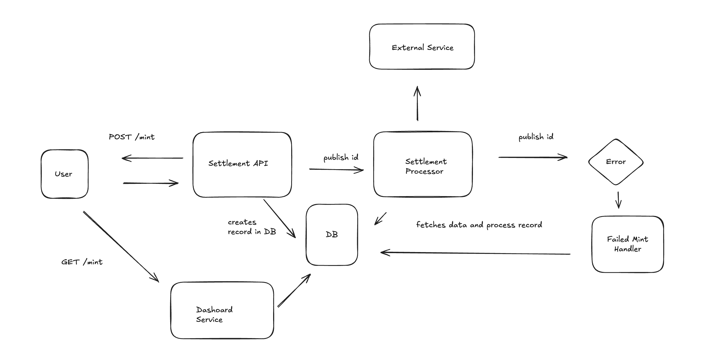

# Alongside Infrastructure

> AWS CDK Infrastructure for the Alongside Settlement Processing Challenge

## 🏗️ Architecture Overview



This infrastructure implements a **serverless settlement processing system** using AWS services. The architecture follows event-driven patterns with clear separation of concerns:

- **Frontend**: Static SPA hosted on S3 + CloudFront
- **API Layer**: API Gateway with Lambda functions
- **Processing**: Asynchronous processing via SQS + Lambda
- **Storage**: DynamoDB for persistent data
- **Monitoring**: CloudWatch with custom dashboards and alarms

## ☁️ AWS Services


### **Core Services**

| Service | Purpose | Configuration |
|---------|---------|---------------|
| **API Gateway** | REST API endpoints | Rate limited: 20 req/10min |
| **Lambda** | Serverless compute | Node.js 20.x |
| **DynamoDB** | NoSQL database |
| **SQS** | Message queuing | With DLQ, 5min visibility |
| **CloudFront** | CDN distribution | Global edge locations |
| **S3** | Static hosting |
| **Route 53** | DNS management | Custom domain routing |
| **ACM** | SSL certificates |
| **CloudWatch** | Monitoring | Custom dashboards + alarms |

📦 Stacks
SettlementStack (main)
- RestApiService
- SettlementService
- SettlementProcessorService
- DashboardService
- MonitoringService
- StaticWebsiteDeployment
- CertificateWrapper

### **Installation**

```bash
# From monorepo root
npm install

# From infrastructure directory
cd infrastructure
npm install

# Bootstrap CDK (first time only)
cdk bootstrap
```

## Deployment

```bash
# From monorepo root
npm run infra:deploy
```

### **Rate Limiting**

API Gateway throttling prevents cost overruns:
- **Rate Limit**: 0.033 requests/second (20 per 10 minutes)
- **Burst Limit**: 5 requests
- **Quota**: 288 requests/day

## Security

### **IAM Policies**

Each Lambda has minimal required permissions:

```typescript
// Example: Mint Lambda permissions
const mintTablePolicy = new iam.PolicyStatement({
  actions: ["dynamodb:PutItem"],
  resources: [table.tableArn],
});
```
